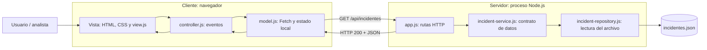

# Fase III — Flujo cliente-servidor del SOC Hospitalario

## 1. Objetivo y alcance

Demostrar cómo el navegador solicita incidentes a un servidor Node.js y actualiza la tabla sin recargar la página. Se amplía el prototipo de las fases I y II: se conservan HTML, CSS, validación dinámica, anuncios ARIA y MVC; la consulta ahora pasa por una API HTTP.

El prototipo implementa los endpoints **GET /api/incidentes** y **GET /api/salud** (Health Check). El archivo JSON contiene datos simulados. Los registros del formulario continúan solo en memoria del navegador: no existe POST, base de datos, autenticación ni envío de alertas o adjuntos.

## 2. Componentes y roles



Lectura textual: **Usuario → Cliente MVC → HTTP → Servidor → Servicio → Repositorio → JSON**. La respuesta vuelve al modelo cliente y el controlador solicita a la vista que renderice la tabla.

| Componente / rol | Responsabilidad |
| --- | --- |
| Usuario / analista | Consulta incidentes y prueba el registro simulado. No representa un rol de autorización implementado. |
| Cliente (navegador) | Presenta la interfaz, valida entradas, envía Fetch y anuncia resultados con ARIA. |
| Servidor Node.js | Escucha conexiones locales, entrega recursos y responde la ruta JSON. |
| Servicio | Verifica campos, códigos únicos, fechas y severidades antes de devolver la lista. |
| Repositorio | Lee y convierte el archivo JSON; no conoce HTTP ni elementos de pantalla. |
| Operador del prototipo | Inicia o detiene el servidor y ejecuta las pruebas. |

## 3. Arquitectura n-capas

Se implementan **cuatro capas lógicas**: presentación (`index.html`, CSS y MVC del cliente), transporte HTTP (`server/app.js`), aplicación (`server/incident-service.js`) y acceso a datos (`server/incident-repository.js` y archivo JSON). `server.js` inicia el proceso.

Las dependencias del servidor siguen HTTP → servicio → repositorio. Así se puede reemplazar el archivo por una base de datos cambiando el repositorio, conservando el contrato de la API. MVC organiza internamente el cliente; las capas organizan las responsabilidades del sistema completo.

Las capas no equivalen a cuatro máquinas: el despliegue mínimo tiene navegador y proceso Node.js, y el archivo reside en el equipo del servidor. Durante la demostración ambos procesos se ejecutan en el mismo equipo.

## 4. Petición y respuesta HTTP

1. El usuario abre `http://127.0.0.1:3000`. El navegador solicita HTML y después CSS y JavaScript.
2. El controlador llama al modelo. Este ejecuta Fetch hacia `/api/incidentes` con `Accept: application/json` y un tiempo límite de 10 segundos.
3. El servidor reconoce la ruta y el método GET, invoca al servicio y este obtiene el JSON mediante el repositorio.
4. El servidor responde con estado 200 y `Content-Type: application/json; charset=utf-8`. El navegador comprueba `response.ok` y convierte el cuerpo con `response.json()`.
5. El controlador entrega los datos a la vista, que crea las filas y anuncia el resultado. Si falla la petición, muestra un mensaje y ofrece reintentar.

Petición de ejemplo (sin cuerpo):

```http
GET /api/incidentes HTTP/1.1
Host: 127.0.0.1:3000
Accept: application/json
```

Respuesta ilustrativa abreviada (la respuesta real contiene la lista completa):

```http
HTTP/1.1 200 OK
Content-Type: application/json; charset=utf-8
Cache-Control: no-store

[{"codigo":"INC-2041","fecha":"2026-09-11T11:20:00","amenaza":"Incidente simulado","servicio":"Archivo","severidad":"critica","estado":"Aislamiento VLAN"}]
```

El método indica la operación; GET consulta recursos. La ruta identifica el recurso; las cabeceras describen el formato; el código de estado comunica el resultado y el cuerpo transporta los datos. El JSON es un formato de intercambio, no una base de datos. HTTP sigue un intercambio de peticiones y respuestas entre cliente y servidor. [Referencia: MDN, descripción de HTTP](https://developer.mozilla.org/en-US/docs/Web/HTTP/Guides/Overview).

| Estado | Comportamiento del prototipo |
| --- | --- |
| 200 | Consulta correcta; un arreglo vacío también es válido. |
| 400 | URL de petición que no puede interpretarse. |
| 404 | Ruta inexistente o archivo no publicado. |
| 405 | Método distinto de GET sobre una ruta conocida; cabecera `Allow: GET`. |
| 500 | Error interno al leer, interpretar o validar los datos. |

Cliente y API comparten esquema, host y puerto, por lo que son del mismo origen. No se necesita habilitar CORS para esta demostración. El servidor publica únicamente los recursos declarados, evitando entregar su código o el archivo de datos directamente.

## 5. Ejecución y evidencia

Requiere Node.js; se verificó con Node 20.11.0. No hay paquetes externos que instalar. El servidor utiliza el módulo integrado `node:http`. [Referencia oficial: API HTTP de Node.js](https://nodejs.org/api/http.html).

Desde la raíz del proyecto:

```sh
npm start
```

Abrir `http://127.0.0.1:3000` y, en otra pestaña, `http://127.0.0.1:3000/api/incidentes`. También funciona la entrada `/proyecto-incidentes-tema1/index.html`. Para esta fase use Node.js, no Live Server ni el servidor Python: estos no implementan la API.

En las herramientas del navegador, abrir **Red / Network**, recargar y seleccionar `incidentes`: comprobar método GET, estado 200, cabeceras y cuerpo JSON. La página anuncia la carga y muestra los cuatro incidentes iniciales. Detener con Ctrl+C.

Pruebas reproducibles:

```sh
npm test
curl.exe -i http://127.0.0.1:3000/api/incidentes
curl.exe -i http://127.0.0.1:3000/no-existe
curl.exe -i -X POST http://127.0.0.1:3000/api/incidentes
```

Los comandos curl requieren que el servidor esté iniciado y permiten observar 200, 404 y 405. `npm test` inicia sus propios servidores en puertos libres y los cierra al terminar. Cubre la lectura real, integración con el modelo cliente, entrega de ambas páginas y recursos, rutas privadas, método incorrecto, error 500, lista vacía y validación del servicio.

Si 3000 está ocupado, en PowerShell ejecutar `$env:PORT = "3001"` y después `npm start`; abrir el puerto indicado en consola. La ruta relativa del cliente funciona también con ese puerto.

## 6. Resultado esperado

Se demuestra el recorrido completo: **interacción del usuario → petición Fetch → procesamiento en capas → respuesta JSON → actualización accesible de la tabla**. La persistencia de nuevos registros en el servidor queda fuera del alcance de este prototipo mínimo.
